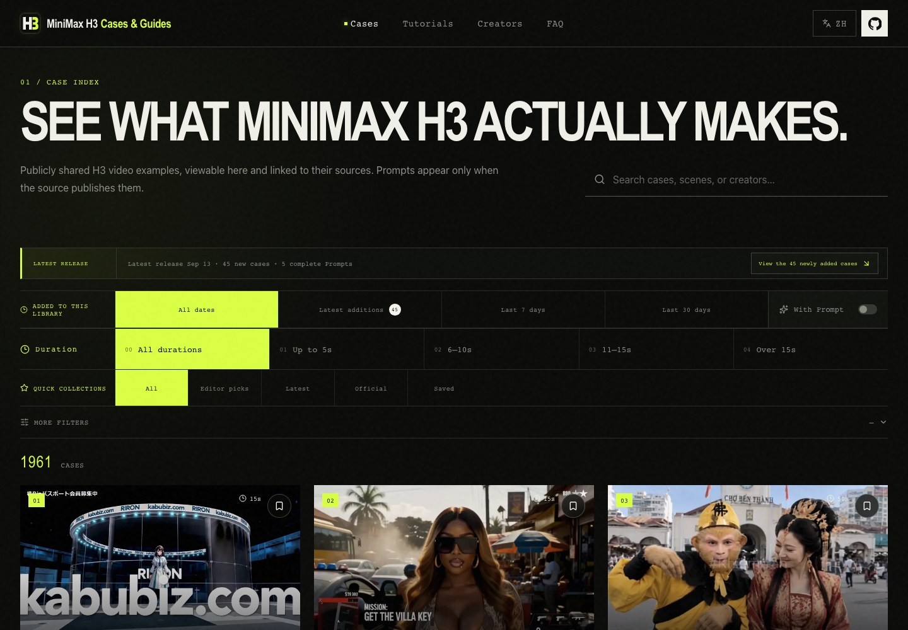
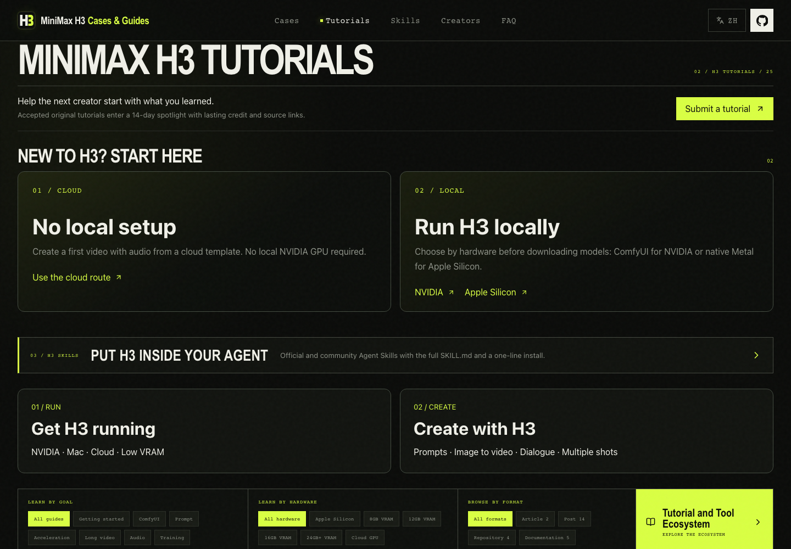
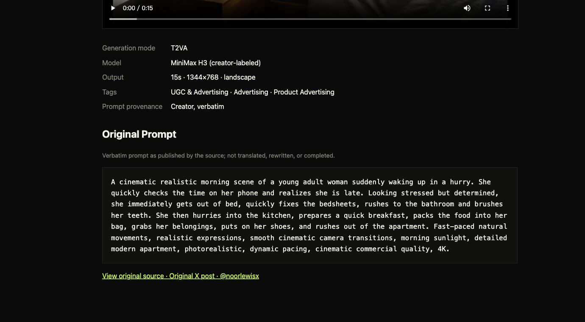

<div align="center">

# MiniMax H3 Cases & Guides

### MiniMax H3 / Hailuo H3 video examples, public Prompts, ComfyUI workflows & deployment tutorials

**997 source-attributed videos · 309 complete public Prompts · 4 foundation routes + 20 community tutorials**

**[English](./README.md)** · **[简体中文](./README.zh-CN.md)**

[](https://h3-field-notes-production.up.railway.app/en/)
[](./CATALOG.md)
[](./data/cases.json)
[](https://h3-field-notes-production.up.railway.app/en/tutorials/)
[](https://github.com/SkyNotSilent/awesome-minimax-h3-cases/stargazers)
[](https://github.com/SkyNotSilent/awesome-minimax-h3-cases/actions/workflows/ci.yml)
[](./LICENSE)

[▶ Browse all 997 video examples](https://h3-field-notes-production.up.railway.app/en/) · [Browse on GitHub](./CATALOG.md) · [中文说明](./README.zh-CN.md) · [Contribute](./CONTRIBUTING.md)

</div>

<a href="https://h3-field-notes-production.up.railway.app/en/">
  <picture>
    <source media="(max-width: 600px)" srcset="./docs/screenshots/case-library-en-mobile.jpg">
    
  </picture>
</a>

**See what MiniMax H3 can actually produce before you spend time setting it up.** MiniMax H3 is also commonly searched as Hailuo H3 or Hailuo 3.0. Browse real outputs from X and MiniMax's official examples through duration-first filters, then switch on **With Prompt** to focus on 309 cases with complete public Prompt text. Truncated excerpts are excluded. Category, style, and scene remain available as deeper filters. Open any case to watch it inside the gallery and jump back to the original source.

<a href="https://h3-field-notes-production.up.railway.app/en/tutorials/">
  <picture>
    <source media="(max-width: 600px)" srcset="./docs/screenshots/tutorials-en-mobile.png">
    
  </picture>
</a>

**Move from examples to execution.** Follow four concise MiniMax H3 setup routes or open 20 source-checked community tutorials covering NVIDIA + ComfyUI, Apple Silicon Metal inference, Prompt and Agent Skills, Turbo LoRA acceleration, low-VRAM deployment, audio workflows, long-video continuation, and Ref2VA training. Every guide keeps its original source and can be copied as a structured AI task.

**Topics covered:** MiniMax H3 · Hailuo H3 · Hailuo 3.0 · AI video examples · MiniMax H3 prompts · ComfyUI workflows · local deployment · Apple Silicon / Metal · Turbo LoRA · long video · audio generation · Ref2VA training.

> **Largest public collection in our 2026-08-16 comparison:** the library now contains 997 playable, source-attributed MiniMax H3 video cases. The closest public case or prompt galleries found in that search contained 300, 222, 135, 67, and 28 examples. Prompt-only lists are not counted as video case libraries.

<details>
<summary>How the collection-size claim was checked</summary>

We searched public GitHub repositories and web results for MiniMax H3 / Hailuo H3 video examples, cases, galleries, and prompts on 2026-08-16. The five largest comparable collections found in that snapshot contained 300, 222, 135, 67, and 28 entries. General resource lists and prompt-only collections without matching playable case videos were excluded. This is a dated comparison—not a permanent claim about every future site.

</details>

## Why use this library?

| What you get | Why it matters |
| --- | --- |
| **997 watchable video examples** | Judge MiniMax H3 / Hailuo H3 by real output, not a feature list |
| **Duration-first browsing** | Jump directly to ≤5s, 6–10s, 11–15s, or >15s outputs, then narrow by content, style, or scene |
| **One-switch public Prompt view** | Show 309 cases with complete public Prompts; truncated excerpts are excluded |
| **Case-specific covers and loading states** | Know what each video contains before opening it and whether the X player is still loading |
| **Original creator and source on every case** | Verify context, publication date, and attribution without hunting for the post |
| **Verbatim public prompts when available** | Copy the exact prompt only when the creator or official script published it; missing prompts are never invented |
| **Chinese and English routes** | Browse the same library in either language without mixed-language pages |

**Current snapshot:** 997 video examples · 994 X-attributed cases · 3 official reproductions · 309 complete public Prompts · 0 Prompt excerpts.

No account, API key, or local model setup is required to browse the public gallery.

### A complete case: hosted video, metadata, source, and public Prompt

[](https://h3-field-notes-production.up.railway.app/en/cases/x-2088844629093601702/)

## Start exploring

| What you want to do | Open |
| --- | --- |
| Watch and filter every MiniMax H3 video example | [Live visual gallery](https://h3-field-notes-production.up.railway.app/en/) |
| Scan all cases without leaving GitHub | [`CATALOG.md`](./CATALOG.md) |
| Query the source-attributed dataset | [`data/cases.json`](./data/cases.json) or [`llms-full.txt`](./public/llms-full.txt) |
| Find a case through an Agent Skill | [`minimax-h3-prompt-library`](./agents/skills/minimax-h3-prompt-library/) |
| Follow a setup route or copy an executable tutorial into an AI agent | [MiniMax H3 tutorial workspace](https://h3-field-notes-production.up.railway.app/en/tutorials/) |

## MiniMax H3 tutorial workspace

The tutorial hub is now a learning and execution workspace instead of a GitHub link list:

- **4 foundation routes:** official setup, NVIDIA + ComfyUI, native Mac inference, and Prompt + Agent Skill.
- **20 community field guides:** source-attributed X tutorials selected for reach and executability across setup, ComfyUI, prompts, acceleration, long video, audio, and training.
- **Bilingual detail pages:** every guide has separate Chinese and English routes, steps, commands, hardware notes, caveats, author, original source, verification date, and visible engagement snapshot.
- **Copy for AI:** one action creates a structured task package with environment checks, commands, risks, sources, and a guardrail to verify the latest README instead of guessing missing steps.

The 13 source-checked ecosystem projects still exist, but now appear as related tools inside the route where they are useful. Community posts are summarized and structured; their full text is not copied.

Weekly discovery follows the source-verification and privacy rules in [`docs/WEEKLY_TUTORIAL_COLLECTION.md`](./docs/WEEKLY_TUTORIAL_COLLECTION.md).

## Generation modes

- **T2VA — text-to-video with audio:** cinematic shots, camera movement, dialogue, music, ambience, and timeline cues from text.
- **FL2VA — first/last-frame video with audio:** image-conditioned motion, transitions, rack focus, composition, and synchronized sound.
- **Ref2VA — multimodal reference-to-video with audio:** video editing, identity and character consistency, audio reference, lip sync, and controlled dialogue.

## Official public examples

| Mode | Example | Public source |
| --- | --- | --- |
| T2VA | After the Fleet Jumps | [MiniMax public script](https://huggingface.co/MiniMaxAI/MiniMax-H3/blob/main/scripts/readme/reproducible-768p-t2va-request.sh) |
| FL2VA | Ramen Rack Focus | [MiniMax public script](https://huggingface.co/MiniMaxAI/MiniMax-H3/blob/main/scripts/readme/reproducible-768p-fl2va-request.sh) |
| Ref2VA | Follow the Wind | [MiniMax public script](https://huggingface.co/MiniMaxAI/MiniMax-H3/blob/main/scripts/readme/reproducible-768p-ref2va-request.sh) |

The catalog now contains 997 public cases: three official reproducible examples and 994 X-attributed community cases. Three hundred nine records preserve complete public Prompts; truncated excerpts are excluded from display and filtering. Archive-backed records disclose and link the public archive used for recovery. Every other entry explicitly marks the Prompt as not completely published. Every published case plays inside the gallery through project storage and keeps its original source link.

## Discovery and review pipeline

```text
Signed-in X browser search
          ↓
Original post URL + public metadata
          ↓
Deterministic deduplication and filtering
          ↓
MiMo V2.5 Pro public-text classification
          ↓
Shortlisted video → MiMo V2.5 low-FPS review
          ↓
data/candidates.json
          ↓
Eligibility + playback verification
          ↓
data/cases.json → website / catalog / Agent Skill
```

X discovery uses the maintainer's existing signed-in browser session, not an X developer token, and never bypasses access controls. Discovery stores public metadata and copies a prompt only when the exact text is visibly published in the source post; it never asks a model to recover a missing prompt. Clear cases are published only after source, model, media, storage, and in-site playback checks pass, while ambiguous or failed cases remain in the review queue. Published videos use project storage for reliable in-site playback and always retain the original X source link. The recurring task prompt lives in [`docs/DAILY_COLLECTION_PROMPT.md`](./docs/DAILY_COLLECTION_PROMPT.md).

## Model routing

This repository uses the existing Xiaomi MiMo Token Plan:

- `mimo-v2.5-pro` for classification of public post text and metadata. It does not generate, rewrite, or infer prompts.
- `mimo-v2.5` for limited video/audio verification of shortlisted cases, never for prompt reconstruction or workflow decomposition.

Copy `.env.example` to `.env` locally. Never commit a real API key. The static public website does not receive or need model credentials.

## Quick start

Requires Node.js 22 or later.

```bash
npm install
npm run dev
```

Run the full quality gate:

```bash
npm test
npm run lint
npm run validate:data
npm run build
npm run catalog
```

The build creates localized case and tutorial pages, `VideoObject` and `HowTo` structured data, sitemap and hreflang links, Open Graph metadata, `robots.txt`, and [`llms.txt`](./public/llms.txt) for AI search and answer engines.

## Deployment

The live website runs on Railway. The Railway service tracks the public GitHub repository's `main` branch, so every accepted push triggers a fresh build and deployment. Runtime secrets are unnecessary for the public frontend; local MiMo credentials stay outside Git.

## Contribution and copyright

Read [`CONTRIBUTING.md`](./CONTRIBUTING.md) before submitting a case. Link the original creator and identify the prompt provenance. Include prompt text only when it can be copied verbatim from the original post or an official public script. Videos are stored outside Git in project storage; do not commit downloaded creator media to the repository. Creators may open an Issue to request correction or removal.

Code is MIT licensed. Videos, prompts, names, and other collected material remain subject to their original owners and source-platform terms. MiniMax H3 is distributed under its own license; this community project is not affiliated with MiniMax.

## Inspiration

The information architecture learns from successful open prompt libraries such as [awesome-gpt-image-2](https://github.com/freestylefly/awesome-gpt-image-2), [awesome-seedance](https://github.com/ZeroLu/awesome-seedance), and [awesome-seedance-2-prompts](https://github.com/YouMind-OpenLab/awesome-seedance-2-prompts). Content, data, visual design, and implementation in this repository are original and specific to MiniMax H3.
