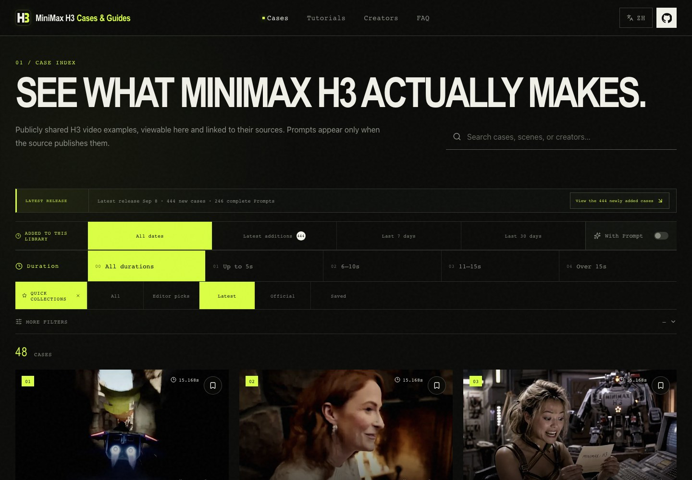

<div align="center">

<a href="https://h3-field-notes-production.up.railway.app/en/"></a>

# MiniMax H3 Cases & Guides

<!-- project-stats:start -->
**The most complete source-attributed MiniMax H3 case and tutorial library: 1788 playable videos, 628 complete public Prompts, and 25 practical guides.**
<!-- project-stats:end -->

**English** · [简体中文](./README.zh-CN.md)

[](https://github.com/SkyNotSilent/awesome-minimax-h3-cases/stargazers)
[](https://github.com/SkyNotSilent/awesome-minimax-h3-cases/forks)
[](https://h3-field-notes-production.up.railway.app/en/)
[](https://h3-field-notes-production.up.railway.app/en/?prompt=1)
[](https://h3-field-notes-production.up.railway.app/en/tutorials/)
[](https://h3-field-notes-production.up.railway.app/en/creators/)
[](https://github.com/SkyNotSilent/awesome-minimax-h3-cases/actions/workflows/ci.yml)
[](https://github.com/SkyNotSilent/awesome-minimax-h3-cases/releases)
[](./LICENSE)

</div>

[](https://h3-field-notes-production.up.railway.app/en/)

<p align="center"><strong>Watch real H3 output first. Inspect a Prompt only when its source publishes the complete text. Then follow a verified route to run it yourself.</strong></p>

[](https://h3-field-notes-production.up.railway.app/en/)

## Start here

| Browse cases | With complete Prompt | Discover creators | Learn from zero | Install Agent Skills |
| --- | --- | --- | --- | --- |
| [Watch every case](https://h3-field-notes-production.up.railway.app/en/) | [Open Prompt collection](https://h3-field-notes-production.up.railway.app/en/?prompt=1) | [Open creator leaderboard](https://h3-field-notes-production.up.railway.app/en/creators/) | [Open tutorials](https://h3-field-notes-production.up.railway.app/en/tutorials/) | [Jump to install](#agent-skills) |

MiniMax H3 is also searched as **Hailuo H3**, **Hailuo 3.0**, and **海螺 H3**. Every published case plays inside the gallery, keeps its original source and creator, and clearly distinguishes a complete verbatim Prompt from an unpublished one. The library never reconstructs, rewrites, or reverse-engineers missing Prompts.

## See what the latest release added

**Latest additions** means the same thing for every visitor: everything added to that channel on the same Beijing-time day as its newest item. It refreshes with every publish, needs no browser history, and does not shift with the visitor's time zone.

- Filter cases and guides by **All**, **Latest additions**, **Last 7 days**, or **Last 30 days**. Date conditions combine with search, duration, Prompt, collection, content, style, scene, goal, and hardware filters.
- Every case and guide shows its catalog-added date; items in the latest release also carry a text **Newly added** label instead of relying on color alone.
- The strip above the filters shows the date and size of the latest release and opens it in the list; when nothing is new it links to the latest 48 cases instead.
- Date views use `added=release|7d|30d`. Older `added=unseen`, `added=today`, and personal `since`/`through` snapshot links all resolve to the latest release.
- Nothing about seen state is stored in the browser, and there is no account, server-side seen history, or notification subscription; keys written by earlier versions are ignored.

## Find the useful cases faster

The homepage remains case-first. Quick collections are independent entry points: choosing one first clears search, catalog-date, duration, Prompt, and advanced filters so the click never lands on an empty list; filters picked afterwards narrow within that collection, and picking **All**, the lit quick-collections label, or the active collection again returns to the complete library:

[](https://h3-field-notes-production.up.railway.app/en/?collection=latest)

- [Editor picks](https://h3-field-notes-production.up.railway.app/en/?collection=featured) — a stable set of 24–28 playable cases, refreshed periodically from public engagement signals and human source checks.
- [Latest additions](https://h3-field-notes-production.up.railway.app/en/?collection=latest) — the existing compatible link, now ordered by first catalog addition rather than source publication date.
- [Official examples](https://h3-field-notes-production.up.railway.app/en/?collection=official) — reproducible MiniMax scripts and source evidence.
- **My saved cases** — the saved list stays in this browser; there is no login or cloud account.

Long videos and complete Prompts are no longer collections; the primary filters cover them: [longer than 15 seconds](https://h3-field-notes-production.up.railway.app/en/?duration=OVER_15) uses the duration filter and [With Prompt](https://h3-field-notes-production.up.railway.app/en/?prompt=1) uses the Prompt switch. Older `collection=long` and `collection=prompt` links resolve to those filters.

Advanced filters now use a fixed bilingual taxonomy instead of turning one-off free text into hundreds of controls:

| Cinematic & Narrative | Action & VFX | Character & Dialogue | Music Video | Dance |
| --- | --- | --- | --- | --- |
| Advertising & Product | Model Comparison | Animation | Local Generation & Workflow | Showcase |

Combine these with 12 visual styles and 14 subject/scene facets. Every option shows its current result count; open any card for hosted playback, public metadata, Prompt provenance, and the original X link.

## Discover the people behind the strongest H3 work

[](https://h3-field-notes-production.up.railway.app/en/creators/)

<!-- creator-stats:start -->
The dynamic creator board turns the archive into a compounding discovery system. It currently ranks **340 featured creators from 915 source-attributed X authors**, with separate views for overall quality, recent activity, case volume, complete Prompt contribution, rising creators, and tutorial authors.
<!-- creator-stats:end -->

- Every profile aggregates the creator's playable cases, complete public Prompts, and source-checked tutorials.
- Rankings use only content already verified and published by this library; they are not official X influence rankings.
- Exact internal monitoring scores, rejected posts, discovery sources, and review cadence remain private.
- Save creators anonymously in this browser or jump to their original X profile.

## Learn by goal or hardware

[](https://h3-field-notes-production.up.railway.app/en/tutorials/)

Two equal learning tracks help you get H3 running and create videos. Eight in-depth selections provide source resources, applicable versions, key steps, chapters and known issues; the remaining entries are clearly marked as short guides. Source checks, community feedback and actual site generation tests are separate evidence categories.

| Goal | Best starting point |
| --- | --- |
| First generated video | [Official / NVIDIA + ComfyUI route](https://h3-field-notes-production.up.railway.app/en/tutorials/official-deployment/) |
| Apple Silicon | [Native C + Metal route](https://h3-field-notes-production.up.railway.app/en/tutorials/mac-native/) |
| 8–12 GB VRAM | [Low-VRAM and quantized routes](https://h3-field-notes-production.up.railway.app/en/tutorials/four-bit-eight-gb/) |
| Faster previews and final output | [Turbo route](https://h3-field-notes-production.up.railway.app/en/tutorials/nvidia-comfyui/) |
| Long video, audio, or training | [Browse by goal and hardware](https://h3-field-notes-production.up.railway.app/en/tutorials/) |
| Compare open-source tools | [Tutorial and tool ecosystem](https://h3-field-notes-production.up.railway.app/en/tutorials/ecosystem/) |

Each guide has a **Copy for AI** action that creates an execution package from structured fields. It requires the agent to verify the latest upstream README and forbids guessed commands or compatibility claims.

## Agent Skills

Install both repository Skills for Codex and Claude Code:

```bash
npx skills add https://github.com/SkyNotSilent/awesome-minimax-h3-cases \
  --skill minimax-h3-prompt-library minimax-h3-tutorial-guide \
  --agent codex claude-code
```


| Skill | What it does | Hard boundary |
| --- | --- | --- |
| [`minimax-h3-prompt-library`](./agents/skills/minimax-h3-prompt-library/) | Finds real cases and returns a complete source-published Prompt when available | Never generates, rewrites, translates, or infers a Prompt |
| [`minimax-h3-tutorial-guide`](./agents/skills/minimax-h3-tutorial-guide/) | Selects a checked route by OS, GPU, VRAM, time, and goal | Never guesses missing commands, versions, or compatibility |

Example output is structured as a recommended route, environment check, execution plan, success criteria, rollback, and dated sources.

## Data, automation, and trust

<!-- project-snapshot:start -->
**Current generated snapshot:** 1788 cases · 28 Editor picks · 628 complete public Prompts · 25 tutorials · 340 ranked creators from 915 source authors · 8 flagship guides · 14 ecosystem resources · content checked through 2026-09-08.
<!-- project-snapshot:end -->

- [`data/project-stats.json`](./data/project-stats.json) is the canonical public count snapshot; CI rejects stale website and README numbers.
- [`data/cases.json`](./data/cases.json) stores source-attributed case metadata; creator videos live outside Git in project storage.
- [`data/tutorial-guides.json`](./data/tutorial-guides.json) stores bilingual structured guides; [`data/tutorials.json`](./data/tutorials.json) stores dated ecosystem snapshots.
- [`data/creators.json`](./data/creators.json) is generated from published cases and tutorials; private creator monitoring stays under ignored `.review/` files.
- Every public case and guide has an immutable ISO `addedAt`: the first time it entered the public catalog. Source `publishedAt`, review `approvedAt`, and guide `verifiedAt` keep their separate meanings; copy edits, Prompt additions, metric refreshes, and re-verification do not create unread updates.
- Daily case discovery and weekly tutorial discovery keep private candidates in `.review/`; credentials and discovery labels never enter Git, the frontend, or SEO.
- Builds generate localized case/tutorial pages, canonical and hreflang links, `VideoObject`/`HowTo` JSON-LD, sitemap, Open Graph data, [`llms.txt`](./public/llms.txt), and [`llms-full.txt`](./public/llms-full.txt).
- `npm run screenshots` rebuilds the site, synchronizes measured build sizes, captures the current bilingual opening screen and library views on desktop/mobile, and writes only screenshots whose rendered bytes changed.

## Performance architecture

The source of truth remains `data/cases.json`, but production builds no longer ship it in the homepage JavaScript. The build derives a compact `/data/catalog.json`, one `/data/cases/{id}.json` detail file per case, and language-specific search indexes. The catalog retains the media URL, original-source URL, poster, filters, and `addedAt`, so playback and filtering never wait for detail text.

- The homepage renders 36 matching cards, then adds 24 near the list end or through a keyboard-focusable **Load more** button. Filters still evaluate the complete compact catalog and report the true total.
- The first nine cards may animate for at most 720ms; every later card is immediately visible. Reduced-motion mode disables card motion completely.
- Clicking a hosted case starts `/media/` during the same interaction, mounts the player independently, and fetches Prompt/summary detail in parallel. A detail failure cannot block video or the original-source link.
- Full Prompt/summary search loads only after the search field is focused. Until then, title, author, taxonomy, and tag search remain available locally; there is no search server, and raw search text stays in the browser.
- Local JPEG posters receive 360px and 720px WebP derivatives during builds, while the original image remains the fallback. New publishing builds generate the same variants automatically.
- Homepage JSON-LD and `<noscript>` expose the latest 48 cases. Static bilingual archive pages expose the rest in groups of 48, while every case detail page remains independently indexable.
- Fingerprinted JS/CSS are immutable; HTML and runtime JSON use one-minute shared-cache freshness with stale revalidation. `/media/` redirects use a five-minute shared-cache window, while signed object URLs remain valid for one hour.
- Hosted video uses two immutable storage tiers: `videos/{id}.mp4` preserves the highest-quality source for rollback, while `play/v1/{id}.mp4` is the site playback copy. `/media/{id}.mp4` stays stable and selects its tier through `VIDEO_S3_PLAYBACK_PREFIX`; the existing X link remains the route to the original post and its highest available presentation.
- Site playback is capped at a 1280px long edge and about 3Mbps H.264/AAC with faststart. Mirroring prefers the highest native X MP4 that already meets the profile and transcodes only when necessary; publication is blocked until both source and playback objects pass size, duration, codec, faststart, and Range checks.
- Run `npm run videos:playback:audit` for a read-only inventory, `npm run videos:playback:migrate -- --apply` to populate the versioned playback tier, and `npm run videos:playback:verify` before switching or after a release. Migration reports stay in ignored `.review/` files.

<!-- build-metrics:start -->
**Reference build (Node 22.23.1, analytics configuration omitted):** 97.1 kB homepage JavaScript gzip · 9.2 kB / 8.8 kB Chinese / English homepage HTML gzip · 5.2 kB first-page API gzip · 4 kB next-page API gzip · 5.5 kB search response gzip · 51.3 kB local fonts (nonblocking) · 1465 kB server-only index gzip. Run `npm run performance:budget` for static budgets and `npm run performance:browser` against a local production server for browser behavior.
<!-- build-metrics:end -->

## Contribute or report a problem

**Made an H3 tutorial? [Submit your original work](https://github.com/SkyNotSilent/awesome-minimax-h3-cases/issues/new?template=tutorial-submission.yml).** Accepted author submissions enter a 14-day rotating spotlight on the tutorial page, with permanent credit and links to your work. Chinese or English submissions welcome; we help with bilingual presentation. [How the spotlight works](./CONTRIBUTING.md#original-author-spotlight).

Read [CONTRIBUTING.md](./CONTRIBUTING.md), then use the focused form:

- [Submit a video case](https://github.com/SkyNotSilent/awesome-minimax-h3-cases/issues/new?template=case-submission.yml)
- [Submit a tutorial](https://github.com/SkyNotSilent/awesome-minimax-h3-cases/issues/new?template=tutorial-submission.yml)
- [Report broken media](https://github.com/SkyNotSilent/awesome-minimax-h3-cases/issues/new?template=broken-media.yml)
- [Challenge Prompt provenance](https://github.com/SkyNotSilent/awesome-minimax-h3-cases/issues/new?template=prompt-dispute.yml)
- [Request correction or removal](https://github.com/SkyNotSilent/awesome-minimax-h3-cases/issues/new?template=takedown.yml)
- [Correct, merge, or remove a creator profile](https://github.com/SkyNotSilent/awesome-minimax-h3-cases/issues/new?template=creator-correction.yml)
- [Show work or suggest a guide](https://github.com/SkyNotSilent/awesome-minimax-h3-cases/discussions)

## Releases and growth

[Read the changelog](./CHANGELOG.md) · [Follow releases](https://github.com/SkyNotSilent/awesome-minimax-h3-cases/releases) · [Browse the GitHub catalog](./CATALOG.md)

[](https://www.star-history.com/#SkyNotSilent/awesome-minimax-h3-cases&Date)

## License and acknowledgements

Code is MIT licensed. Videos, Prompts, names, and other collected material remain subject to their original owners and source-platform terms. This community project is not affiliated with MiniMax.

The product packaging studies strong open libraries such as [awesome-gpt-image-2](https://github.com/freestylefly/awesome-gpt-image-2); tutorial organization also learns from [MiniMax-H3](https://github.com/MiniMax-AI/MiniMax-H3), [h3.c](https://github.com/antirez/h3.c), [ComfyUI-wiki](https://github.com/602387193c/ComfyUI-wiki), and [OpenMontage](https://github.com/calesthio/OpenMontage). All case data, tutorial structure, visual design, and implementation here are specific to MiniMax H3 Cases & Guides.
