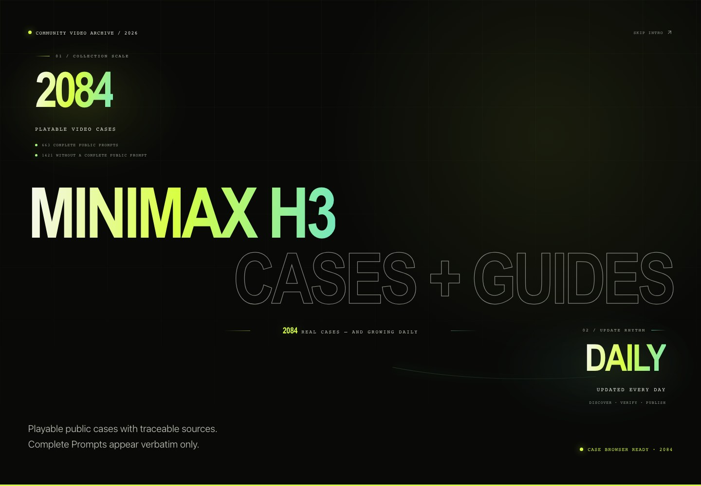
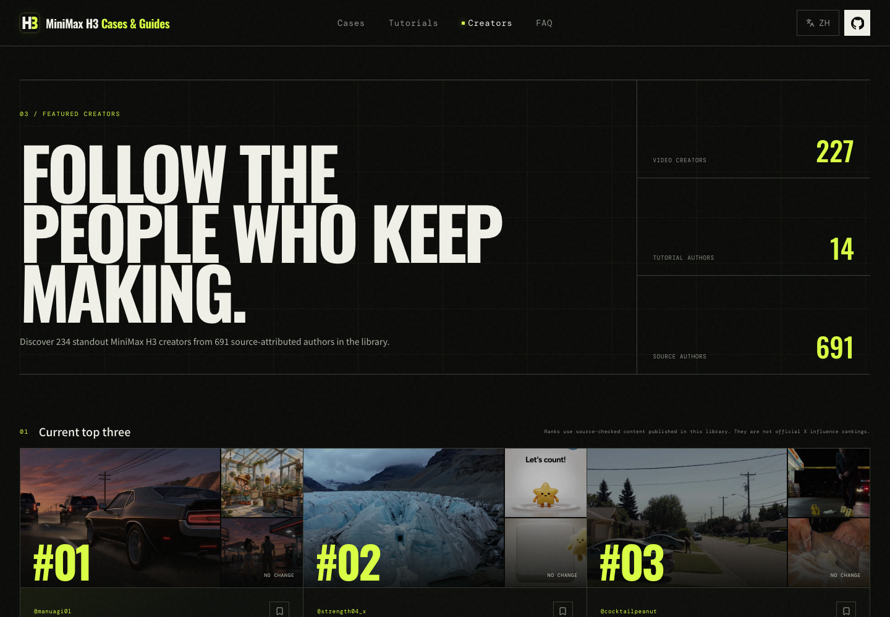

<div align="center">

<a href="https://h3-field-notes-production.up.railway.app/en/"></a>

# MiniMax H3 Cases & Guides

<!-- project-stats:start -->
**The most complete source-attributed MiniMax H3 case and tutorial library: 1133 playable videos, 337 complete public Prompts, and 24 practical guides.**
<!-- project-stats:end -->

**English** · [简体中文](./README.zh-CN.md)

[](https://github.com/SkyNotSilent/awesome-minimax-h3-cases/stargazers)
[](https://github.com/SkyNotSilent/awesome-minimax-h3-cases/forks)
[](https://h3-field-notes-production.up.railway.app/en/)
[](https://h3-field-notes-production.up.railway.app/en/?collection=prompt)
[](https://h3-field-notes-production.up.railway.app/en/tutorials/)
[](https://h3-field-notes-production.up.railway.app/en/creators/)
[](https://github.com/SkyNotSilent/awesome-minimax-h3-cases/actions/workflows/ci.yml)
[](https://github.com/SkyNotSilent/awesome-minimax-h3-cases/releases)
[](./LICENSE)

</div>

[](https://h3-field-notes-production.up.railway.app/en/)

<p align="center"><strong>Watch real H3 output first. Inspect a Prompt only when its source publishes the complete text. Then follow a verified route to run it yourself.</strong></p>

[](https://h3-field-notes-production.up.railway.app/en/)

## Start here

| Browse cases | With complete Prompt | Discover creators | Learn from zero | Install Agent Skills |
| --- | --- | --- | --- | --- |
| [Watch every case](https://h3-field-notes-production.up.railway.app/en/) | [Open Prompt collection](https://h3-field-notes-production.up.railway.app/en/?collection=prompt) | [Open creator leaderboard](https://h3-field-notes-production.up.railway.app/en/creators/) | [Open tutorials](https://h3-field-notes-production.up.railway.app/en/tutorials/) | [Jump to install](#agent-skills) |

MiniMax H3 is also searched as **Hailuo H3**, **Hailuo 3.0**, and **海螺 H3**. Every published case plays inside the gallery, keeps its original source and creator, and clearly distinguishes a complete verbatim Prompt from an unpublished one. The library never reconstructs, rewrites, or reverse-engineers missing Prompts.

## See what changed since your last visit

First-time visitors start with the complete case library, so the existing archive is never presented as hundreds of unread items. Returning visitors with new material automatically open a fixed **Since last visit** snapshot. The summary reports new cases and guides together, shows the latest catalog date, and keeps the current snapshot visible after it has been marked as seen.

- Filter cases and guides by **Since last visit**, **Today**, **Last 7 days**, **Last 30 days**, or **All**. Date conditions combine with search, duration, Prompt, collection, content, style, scene, goal, and hardware filters.
- Every case and guide shows its catalog-added date; current-snapshot items also carry a text **Newly added** label instead of relying on color alone.
- The homepage links directly to the same batch of new tutorials with a shareable `added=unseen&since=<ISO date-time>` URL. Other date views use `added=today|7d|30d`.
- Seen state stays only in this browser under `minimax-h3-updates-seen-through-v1`. There is no account, server-side history, notification subscription, or tracking.

## Find the useful cases faster

The homepage remains case-first. Quick collections work together with duration, Prompt, content, style, scene, and search filters:

- [Editor picks](https://h3-field-notes-production.up.railway.app/en/?collection=featured) — verified, playable cases with a complete public Prompt.
- [Latest additions](https://h3-field-notes-production.up.railway.app/en/?collection=latest) — the existing compatible link, now ordered by first catalog addition rather than source publication date.
- [Official examples](https://h3-field-notes-production.up.railway.app/en/?collection=official) — reproducible MiniMax scripts and source evidence.
- [Long videos](https://h3-field-notes-production.up.railway.app/en/?collection=long) — outputs longer than 15 seconds.
- **My saved cases** — anonymous browser-local bookmarks; no login, tracking, or cloud account.

Browse visually by **cinematic**, **live action**, **animation**, **dialogue**, **visual effects**, **product**, **character**, and **comparison** tags, then open any card for hosted playback, public metadata, Prompt provenance, and the original X link.

| Cinematic & VFX | Live action & dialogue | Animation & characters | Product & comparison |
| --- | --- | --- | --- |
| Film-grade shots, camera moves, transformations | People, performance, speech, emotion | Anime, illustration, creatures, stylized worlds | Ads, product demos, model comparisons |

## Discover the people behind the strongest H3 work

[](https://h3-field-notes-production.up.railway.app/en/creators/)

<!-- creator-stats:start -->
The dynamic creator board turns the archive into a compounding discovery system. It currently ranks **234 featured creators from 691 source-attributed X authors**, with separate views for overall quality, recent activity, case volume, complete Prompt contribution, rising creators, and tutorial authors.
<!-- creator-stats:end -->

- Every profile aggregates the creator's playable cases, complete public Prompts, and source-checked tutorials.
- Rankings use only content already verified and published by this library; they are not official X influence rankings.
- Exact internal monitoring scores, rejected posts, discovery sources, and review cadence remain private.
- Save creators anonymously in this browser or jump to their original X profile.

## Learn by goal or hardware

[](https://h3-field-notes-production.up.railway.app/en/tutorials/)

The tutorial workspace starts with four zero-to-one routes and then exposes community field guides directly—no link-directory detour. Eight flagship guides include tested versions, exact commands, expected output, success checks, troubleshooting, and rollback steps.

| Goal | Best starting point |
| --- | --- |
| First generated video | [Official / NVIDIA + ComfyUI route](https://h3-field-notes-production.up.railway.app/en/tutorials/official-deployment/) |
| Apple Silicon | [Native C + Metal route](https://h3-field-notes-production.up.railway.app/en/tutorials/mac-native/) |
| 8–12 GB VRAM | [Low-VRAM and quantized routes](https://h3-field-notes-production.up.railway.app/en/tutorials/four-bit-eight-gb/) |
| Faster previews and final output | [Turbo route](https://h3-field-notes-production.up.railway.app/en/tutorials/nvidia-comfyui/) |
| Long video, audio, or training | [Browse by goal and hardware](https://h3-field-notes-production.up.railway.app/en/tutorials/) |
| Compare open-source tools | [Tutorial and tool ecosystem](https://h3-field-notes-production.up.railway.app/en/tutorials/ecosystem/) |

Each guide has a **Copy for AI** action that creates an execution package from structured fields. It requires the agent to verify the latest upstream README and forbids guessed commands or compatibility claims.

## Agent Skills

Install both repository Skills for Codex and Claude Code:

```bash
npx skills add https://github.com/SkyNotSilent/awesome-minimax-h3-cases \
  --skill minimax-h3-prompt-library minimax-h3-tutorial-guide \
  --agent codex claude-code
```


| Skill | What it does | Hard boundary |
| --- | --- | --- |
| [`minimax-h3-prompt-library`](./agents/skills/minimax-h3-prompt-library/) | Finds real cases and returns a complete source-published Prompt when available | Never generates, rewrites, translates, or infers a Prompt |
| [`minimax-h3-tutorial-guide`](./agents/skills/minimax-h3-tutorial-guide/) | Selects a checked route by OS, GPU, VRAM, time, and goal | Never guesses missing commands, versions, or compatibility |

Example output is structured as a recommended route, environment check, execution plan, success criteria, rollback, and dated sources.

## Data, automation, and trust

<!-- project-snapshot:start -->
**Current generated snapshot:** 1133 cases · 337 complete public Prompts · 24 tutorials · 234 ranked creators from 691 source authors · 8 flagship guides · 14 ecosystem resources · content checked through 2026-08-29.
<!-- project-snapshot:end -->

- [`data/project-stats.json`](./data/project-stats.json) is the canonical public count snapshot; CI rejects stale website and README numbers.
- [`data/cases.json`](./data/cases.json) stores source-attributed case metadata; creator videos live outside Git in project storage.
- [`data/tutorial-guides.json`](./data/tutorial-guides.json) stores bilingual structured guides; [`data/tutorials.json`](./data/tutorials.json) stores dated ecosystem snapshots.
- [`data/creators.json`](./data/creators.json) is generated from published cases and tutorials; private creator monitoring stays under ignored `.review/` files.
- Every public case and guide has an immutable ISO `addedAt`: the first time it entered the public catalog. Source `publishedAt`, review `approvedAt`, and guide `verifiedAt` keep their separate meanings; copy edits, Prompt additions, metric refreshes, and re-verification do not create unread updates.
- Daily case discovery and weekly tutorial discovery keep private candidates in `.review/`; credentials and discovery labels never enter Git, the frontend, or SEO.
- Builds generate localized case/tutorial pages, canonical and hreflang links, `VideoObject`/`HowTo` JSON-LD, sitemap, Open Graph data, [`llms.txt`](./public/llms.txt), and [`llms-full.txt`](./public/llms-full.txt).
- `npm run screenshots` rebuilds the site, simulates a returning-user update snapshot, checks bilingual desktop/mobile routes, reads current stats and tutorial data, and refreshes every README screenshot.

## Contribute or report a problem

Read [CONTRIBUTING.md](./CONTRIBUTING.md), then use the focused form:

- [Submit a video case](https://github.com/SkyNotSilent/awesome-minimax-h3-cases/issues/new?template=case-submission.yml)
- [Submit a tutorial](https://github.com/SkyNotSilent/awesome-minimax-h3-cases/issues/new?template=tutorial-submission.yml)
- [Report broken media](https://github.com/SkyNotSilent/awesome-minimax-h3-cases/issues/new?template=broken-media.yml)
- [Challenge Prompt provenance](https://github.com/SkyNotSilent/awesome-minimax-h3-cases/issues/new?template=prompt-dispute.yml)
- [Request correction or removal](https://github.com/SkyNotSilent/awesome-minimax-h3-cases/issues/new?template=takedown.yml)
- [Correct, merge, or remove a creator profile](https://github.com/SkyNotSilent/awesome-minimax-h3-cases/issues/new?template=creator-correction.yml)
- [Show work or suggest a guide](https://github.com/SkyNotSilent/awesome-minimax-h3-cases/discussions)

## Releases and growth

[Read the changelog](./CHANGELOG.md) · [Follow releases](https://github.com/SkyNotSilent/awesome-minimax-h3-cases/releases) · [Browse the GitHub catalog](./CATALOG.md)

[](https://www.star-history.com/#SkyNotSilent/awesome-minimax-h3-cases&Date)

## License and acknowledgements

Code is MIT licensed. Videos, Prompts, names, and other collected material remain subject to their original owners and source-platform terms. This community project is not affiliated with MiniMax.

The product packaging studies strong open libraries such as [awesome-gpt-image-2](https://github.com/freestylefly/awesome-gpt-image-2); tutorial organization also learns from [MiniMax-H3](https://github.com/MiniMax-AI/MiniMax-H3), [h3.c](https://github.com/antirez/h3.c), [ComfyUI-wiki](https://github.com/602387193c/ComfyUI-wiki), and [OpenMontage](https://github.com/calesthio/OpenMontage). All case data, tutorial structure, visual design, and implementation here are specific to MiniMax H3 Cases & Guides.
