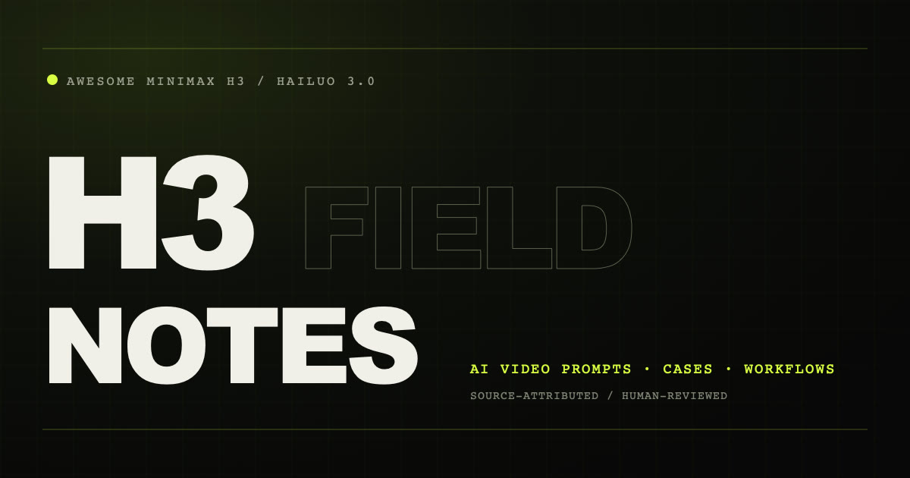

<div align="center">

# Awesome MiniMax H3

### Source-attributed MiniMax H3 / Hailuo 3.0 video cases and verbatim public prompts

[](https://h3-field-notes-production.up.railway.app/)
[](./CATALOG.md)
[](https://github.com/SkyNotSilent/awesome-minimax-h3/actions/workflows/ci.yml)
[](./LICENSE)

[Explore the English library](https://h3-field-notes-production.up.railway.app/en/) · [Toolkit](https://h3-field-notes-production.up.railway.app/en/toolkit/) · [FAQ](https://h3-field-notes-production.up.railway.app/en/faq/) · [中文说明](./README.zh-CN.md) · [Contribute](./CONTRIBUTING.md)

</div>



Awesome MiniMax H3 is an open, source-attributed library for **MiniMax H3**, also searched as **Hailuo 3.0**. It puts real public video cases first, spanning text-to-video, first/last-frame video generation, multimodal reference video editing, synchronized audio, camera movement, dialogue, and character consistency.

The project combines a case-first bilingual website, a machine-readable dataset, and a browser-first X discovery workflow. Every public case keeps its original source. A prompt is shown only when the creator or an official public script published that exact text; otherwise the case explicitly records that no public prompt is available. The project never generates, rewrites, reconstructs, reverse-engineers, or decomposes prompts from a video. Uncertain discoveries stay in a review queue.

## What is included

| Resource | Purpose |
| --- | --- |
| [English visual case library](https://h3-field-notes-production.up.railway.app/en/) | Watch and filter MiniMax H3 examples by mode, category, visual style, scene, and keyword |
| [`data/cases.json`](./data/cases.json) | Source-attributed MiniMax H3 video cases, public prompt records, and metadata |
| [`CATALOG.md`](./CATALOG.md) | Lightweight GitHub-native case index |
| [`agents/skills/minimax-h3-prompt-library`](./agents/skills/minimax-h3-prompt-library/) | Agent Skill for finding cases and retrieving verbatim public prompts; it does not write prompts |
| [`docs/DISCOVERY_WORKFLOW.md`](./docs/DISCOVERY_WORKFLOW.md) | Browser-based X discovery, deduplication, review, and attribution rules |

## H3 toolkit and deployment guides

| Resource | Start here for | Link |
| --- | --- | --- |
| Official MiniMax H3 repository | Weights, deployment guidance, and nine bundled Agent Skills including `h3-prompt-writing` | [MiniMax-AI/MiniMax-H3](https://github.com/MiniMax-AI/MiniMax-H3) |
| MiniMax-H3 Turbo LoRA | Few-step synchronized audio-video generation; use 4 steps for previews and typically 6–8 for stronger v4 output | [larryvrh/MiniMax-H3-Turbo-Lora](https://huggingface.co/larryvrh/MiniMax-H3-Turbo-Lora) |
| ComfyUI H3 Motion Context | Chaining clips while carrying motion and audio context across joins | [NikoDemon80/ComfyUI-H3-Motion-Context](https://github.com/NikoDemon80/ComfyUI-H3-Motion-Context) |
| MiniMax H3 Audio T8 | Native H3 audio conditioning, dual-clock sampling, mixing, trimming, preflight, and Ref2VA workflows | [T8mars/comfyui-minimax-h3-audio-T8](https://github.com/T8mars/comfyui-minimax-h3-audio-T8) |

A practical acceleration starting point is **Turbo LoRA + SageAttention**. EasyCache targets the native 20-step path and is not recommended on top of a 4-step Turbo graph. Fewer sampling steps also do not translate into the same end-to-end speedup because VAE decoding and video packaging remain. These external deployment resources are documented separately from the case archive; the archive does not derive prompts or production workflows from collected videos.

## Generation modes

- **T2VA — text-to-video with audio:** cinematic shots, camera movement, dialogue, music, ambience, and timeline cues from text.
- **FL2VA — first/last-frame video with audio:** image-conditioned motion, transitions, rack focus, composition, and synchronized sound.
- **Ref2VA — multimodal reference-to-video with audio:** video editing, identity and character consistency, audio reference, lip sync, and controlled dialogue.

## Official public examples

| Mode | Example | Public source |
| --- | --- | --- |
| T2VA | After the Fleet Jumps | [MiniMax public script](https://huggingface.co/MiniMaxAI/MiniMax-H3/blob/main/scripts/readme/reproducible-768p-t2va-request.sh) |
| FL2VA | Ramen Rack Focus | [MiniMax public script](https://huggingface.co/MiniMaxAI/MiniMax-H3/blob/main/scripts/readme/reproducible-768p-fl2va-request.sh) |
| Ref2VA | Follow the Wind | [MiniMax public script](https://huggingface.co/MiniMaxAI/MiniMax-H3/blob/main/scripts/readme/reproducible-768p-ref2va-request.sh) |

The catalog now contains 148 public cases: three official reproducible examples and 145 source-attributed X community cases. Sixteen records preserve verbatim prompts published by an official source or creator; every other entry explicitly marks the prompt as not published. The collection spans local ComfyUI benchmarks, image and multimodal reference workflows, model comparisons, music videos, multi-shot films, native audio, and post-production pipelines. X cases play inside the catalog through the official X embed. Permission-cleared media may use a hosted fallback when an embed is unavailable.

## Discovery and review pipeline

```text
Signed-in X browser search
          ↓
Original post URL + public metadata
          ↓
Deterministic deduplication and filtering
          ↓
MiMo V2.5 Pro public-text classification
          ↓
Shortlisted video → MiMo V2.5 low-FPS review
          ↓
data/candidates.json
          ↓
Human approval
          ↓
data/cases.json → website / catalog / Agent Skill
```

X discovery uses the maintainer's existing signed-in browser session, not an X developer token. It never publishes automatically or bypasses access controls. Discovery stores public metadata and copies a prompt only when the exact text is visibly published in the source post. It never asks a model to recover a missing prompt. Publication uses the official X embed first, with a permission-cleared hosted copy reserved for posts that cannot be embedded. The recurring task prompt lives in [`docs/DAILY_COLLECTION_PROMPT.md`](./docs/DAILY_COLLECTION_PROMPT.md).

## Model routing

This repository uses the existing Xiaomi MiMo Token Plan:

- `mimo-v2.5-pro` for classification of public post text and metadata. It does not generate, rewrite, or infer prompts.
- `mimo-v2.5` for limited video/audio verification of shortlisted cases, never for prompt reconstruction or workflow decomposition.

Copy `.env.example` to `.env` locally. Never commit a real API key. The static public website does not receive or need model credentials.

## Quick start

Requires Node.js 22 or later.

```bash
npm install
npm run dev
```

Run the full quality gate:

```bash
npm test
npm run lint
npm run validate:data
npm run build
npm run catalog
```

The build creates discoverable static case pages, `VideoObject` structured data, a video sitemap, `robots.txt`, Open Graph metadata, and [`llms.txt`](./public/llms.txt) for AI search and answer engines.

## Deployment

The live website runs on Railway. The Railway service tracks the public GitHub repository's `main` branch, so every accepted push triggers a fresh build and deployment. Runtime secrets are unnecessary for the public frontend; local MiMo credentials stay outside Git.

## Contribution and copyright

Read [`CONTRIBUTING.md`](./CONTRIBUTING.md) before submitting a case. Link the original creator and identify the prompt provenance. Include prompt text only when it can be copied verbatim from the original post or an official public script. Do not commit downloaded X videos unless redistribution permission is documented and the embed fallback has been approved. Creators may open an Issue to request correction or removal.

Code is MIT licensed. Videos, prompts, names, and other collected material remain subject to their original owners and source-platform terms. MiniMax H3 is distributed under its own license; this community project is not affiliated with MiniMax.

## Inspiration

The information architecture learns from successful open prompt libraries such as [awesome-gpt-image-2](https://github.com/freestylefly/awesome-gpt-image-2), [awesome-seedance](https://github.com/ZeroLu/awesome-seedance), and [awesome-seedance-2-prompts](https://github.com/YouMind-OpenLab/awesome-seedance-2-prompts). Content, data, visual design, and implementation in this repository are original and specific to MiniMax H3.
