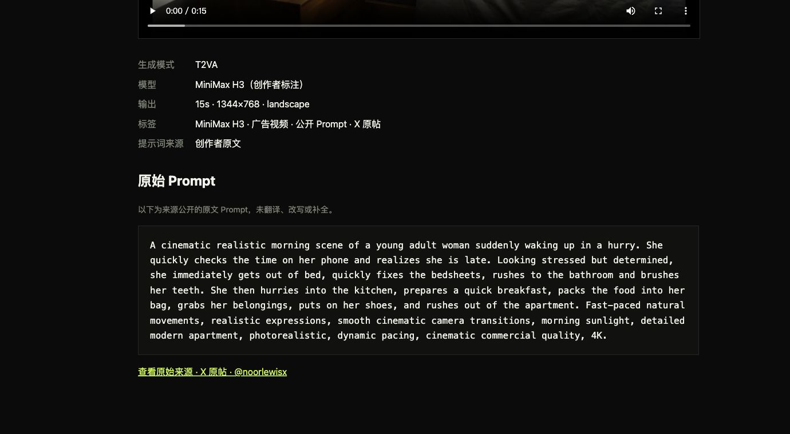

<div align="center">

# Awesome MiniMax H3 视频案例库

### 631 个来源可追溯、可在站内观看的 MiniMax H3 / Hailuo H3 真实视频案例

**[简体中文](./README.zh-CN.md)** · **[English](./README.md)**

[](https://h3-field-notes-production.up.railway.app/)
[](./CATALOG.md)
[](./data/cases.json)
[](https://h3-field-notes-production.up.railway.app/tutorials/)
[](https://github.com/SkyNotSilent/awesome-minimax-h3/stargazers)
[](https://github.com/SkyNotSilent/awesome-minimax-h3/actions/workflows/ci.yml)
[](./LICENSE)

[▶ 浏览全部 631 个视频案例](https://h3-field-notes-production.up.railway.app/) · [在 GitHub 查看案例](./CATALOG.md) · [English](./README.md) · [参与贡献](./CONTRIBUTING.md)

</div>

[](https://h3-field-notes-production.up.railway.app/)

**在花时间安装模型或研究参数之前，先看 MiniMax H3 实际能生成什么。** MiniMax H3 也常被搜索为 Hailuo H3、Hailuo 3.0、海螺 H3 或海螺 3.0。这里汇总来自 X 与 MiniMax 官方公开示例的文字生视频、图生视频和视频生视频真实输出，可以按生成模式、分类、风格与场景筛选。打开任意案例即可站内观看，并能随时回到原作者帖子。

> **截至 2026-08-16，我们公开检索并核验到的同类库中规模最大：** 631 个可播放、来源可追溯的 MiniMax H3 视频案例。同次检索中较大的公开案例或 Prompt 图库分别约为 300、222、135、67 和 28 条；只有 Prompt、没有对应视频案例的列表不计入案例库对比。

<details>
<summary>“规模最大”是如何核验的</summary>

我们在 2026-08-16 检索了公开 GitHub 仓库和网页中的 MiniMax H3 / Hailuo H3 视频案例、示例、图库与 Prompt 库。对比对象包括 [BeatAPI 的 300 条 Prompt 图库](https://github.com/BeatAPI/awesome-minimax-h3-prompts)、[xianyu110 的 222 条 Prompt 图库](https://github.com/xianyu110/awesome-minimax-h3-prompts)、[stimQQ 的带视频图库](https://github.com/stimQQ/stunning-minimax-h3-prompts)、[收录 45 个示例 / 67 个视频的官方展示索引](https://minimaxh3.app/showcase)，以及 [ImagineVid 的 28 个核验案例](https://github.com/imagineVid/Awesome-minimax-h3-prompts-and-skills)。不含没有对应可播放案例视频的通用资源列表和纯 Prompt 集合。这是带日期、可复核的对比，不代表对未来所有网站作永久性声明。

</details>

## 为什么使用这个案例库？

| 你能得到什么 | 对用户的价值 |
| --- | --- |
| **631 个可观看视频案例** | 不读功能列表，直接根据真实输出判断 MiniMax H3 / Hailuo H3 的效果 |
| **关键词搜索与多维筛选** | 快速找到 T2VA、FL2VA、Ref2VA、电影、舞蹈、对白、音乐、广告与本地生成案例 |
| **每条案例独立封面与加载状态** | 点开前先看到视频内容，并能分辨 X 播放器是在加载还是加载失败 |
| **每条案例保留作者与原帖** | 无需四处找来源，即可核对上下文、发布日期和原作者 |
| **仅展示来源公开的 Prompt 原文** | 原作者公开时可以直接复制；未公开时绝不反推、补写或伪造 |
| **中英文完全隔离** | 可以在中文或英文界面浏览同一套案例，不混杂另一种语言 |

**当前规模：** 631 个视频案例 · 628 个 X 原帖案例 · 3 个官方复现案例 · 27 条公开 Prompt 原文。

浏览公开案例不需要账号、API Key 或本地部署模型。

### 一个完整案例：站内视频、规格、原始来源与公开 Prompt

[](https://h3-field-notes-production.up.railway.app/cases/x-2088844629093601702/)

## 直接开始

| 你想做什么 | 入口 |
| --- | --- |
| 站内观看并筛选全部 MiniMax H3 视频案例 | [可视化案例库](https://h3-field-notes-production.up.railway.app/) |
| 不离开 GitHub 快速浏览全部案例 | [`CATALOG.md`](./CATALOG.md) |
| 查询带来源的结构化数据 | [`data/cases.json`](./data/cases.json) 或 [`llms-full.txt`](./public/llms-full.txt) |
| 让 Agent 帮你查找案例 | [`minimax-h3-prompt-library`](./agents/skills/minimax-h3-prompt-library/) |
| 选择 H3 部署、导演工作流、加速、训练或资源导航 | [可搜索的 H3 生态指南](https://h3-field-notes-production.up.railway.app/tutorials/) |

## H3 教程与生态指南

教程页目前整理了 13 条经过来源核验的 H3 项目与路线：每一条都说明它解决什么问题、适合谁、如何开始，以及原始文档在哪里。

| 资源 | 先看什么 | 地址 |
| --- | --- | --- |
| h3.c / h3-metal | Apple Silicon 原生 C + Metal 推理，不依赖 Python、PyTorch 或 ComfyUI | [antirez/h3.c](https://github.com/antirez/h3.c) |
| MiniMax H3 官方仓库 | 权重、部署说明，以及包括 `h3-prompt-writing` 在内的 9 个 Agent Skill | [MiniMax-AI/MiniMax-H3](https://github.com/MiniMax-AI/MiniMax-H3) |
| MiniMax-H3 Turbo LoRA | 4–8 步同步音视频加速；4 步预览，v4 在 6–8 步通常更稳 | [larryvrh/MiniMax-H3-Turbo-Lora](https://huggingface.co/larryvrh/MiniMax-H3-Turbo-Lora) |
| ComfyUI H3 Motion Context | 多片段续接，延续上一段的画面运动与音频上下文 | [NikoDemon80/ComfyUI-H3-Motion-Context](https://github.com/NikoDemon80/ComfyUI-H3-Motion-Context) |
| MiniMax H3 Audio T8 | 86 个原生 H3 节点：稳定音频条件与双时钟采样，以及明确隔离的实验工作流 | [T8mars/comfyui-minimax-h3-audio-T8](https://github.com/T8mars/comfyui-minimax-h3-audio-T8) |
| H3 Director 导演台 | 多段时间线、T2V/FL2V/Ref2VA/V2V、选择运行与二次精修 | [AIMixer/ComfyUI_MiniMaxH3_Director](https://github.com/AIMixer/ComfyUI_MiniMaxH3_Director) |
| Spectrum for H3 | 预测部分 Transformer 计算，并提供固定素材 A/B 的配置建议 | [xmarre/ComfyUI-Spectrum-MiniMax-H3](https://github.com/xmarre/ComfyUI-Spectrum-MiniMax-H3) |
| MiniMax H3 Easy | 统一素材输入、`@` 引用、对白块和更紧凑的 ComfyUI 接线 | [nkxx188/ComfyUI-MiniMaxH3-Easy](https://github.com/nkxx188/ComfyUI-MiniMaxH3-Easy) |
| H3 FineTuning | Rectified-flow 训练、latent 缓存、LoRA 与多 GPU ZeRO-3 | [IAmIronMan42/MiniMax-H3-FineTuning](https://github.com/IAmIronMan42/MiniMax-H3-FineTuning) |
| Awesome MiniMax H3 | 模型、量化、LoRA、节点、教程与工作流资源导航 | [wildminder/awesome-minimax-H3](https://github.com/wildminder/awesome-minimax-H3) |

独立教程页支持筛选官方入门、Mac、导演工作流、加速、长视频、音频、训练微调与资源导航。这些外部资源与案例档案分开维护；案例库不会从收录视频中派生提示词或制作流程。

[](https://h3-field-notes-production.up.railway.app/tutorials/)

## 自动采集路线

```text
X 登录态浏览器搜索
        ↓
原帖链接 + 公开元数据
        ↓
规则去重与初筛
        ↓
MiMo V2.5 Pro 公开文本分类
        ↓
仅入围视频 → MiMo V2.5 低 FPS 核验
        ↓
data/candidates.json
        ↓
入库条件与播放校验
        ↓
data/cases.json → 网站 / GitHub / Agent Skill
```

这条路线不需要 X API Token，但需要 Mac 上现有的 X 登录态，并且不会绕过登录限制。发现阶段只记录公开元数据，只有原帖逐字展示 Prompt 时才复制原文，绝不让模型补写或反推。来源、模型、媒体、存储和站内播放全部校验通过的明确案例可直接发布；模糊项或失败项继续留在审核队列。已发布视频统一使用项目存储保证站内播放，并始终保留 X 原帖入口。详细规则见 [`docs/DISCOVERY_WORKFLOW.md`](./docs/DISCOVERY_WORKFLOW.md)。

## 模型与密钥

只使用现有小米 MiMo Token Plan：

- `mimo-v2.5-pro`：对原帖公开文本和元数据做分类，不生成、不改写、不推断 Prompt；
- `mimo-v2.5`：对入围视频与音频做有限核验，不用于重建提示词或拆解工作流。

真实密钥只放本机 `.env` 或受保护的服务端 Secret；不会写进前端、GitHub 仓库或构建产物。公开网站本身完全不需要 API Key。

## 本地运行

需要 Node.js 22+：

```bash
npm install
npm run dev
```

完整检查：

```bash
npm test
npm run lint
npm run validate:data
npm run build
npm run catalog
```

构建过程会生成独立案例页、`VideoObject` 结构化数据、视频 Sitemap、Open Graph 元数据、`robots.txt` 和 `llms.txt`，兼顾传统 SEO 与面向 AI 搜索/答案引擎的 GEO 可发现性。

## Railway 自动部署

线上站点运行于 Railway。Railway 追踪公开 GitHub 仓库的 `main` 分支；合并或推送到主分支后会自动构建并更新。手动部署只作为故障排查时的兜底。

## 数据与版权原则

- 只收录能追溯原作者与原始链接的案例；
- Prompt 仅在原作者或官方公开脚本逐字发布时收录，并保持原文不变；
- 原帖未公开 Prompt 时不生成、不补全、不翻译成原文、不改写、不重建、不反推、不拆解，明确标注为未公开；
- 视频文件保存在 Git 仓库之外的项目存储中，站内播放时始终保留原作者与 X 原帖入口；
- 不确定项始终留在审核队列；
- 创作者可通过 Issue 请求纠错或移除。

代码使用 MIT License。视频、提示词、姓名和其他收录内容仍受原权利人与来源平台条款约束。本项目与 MiniMax 无隶属关系。
