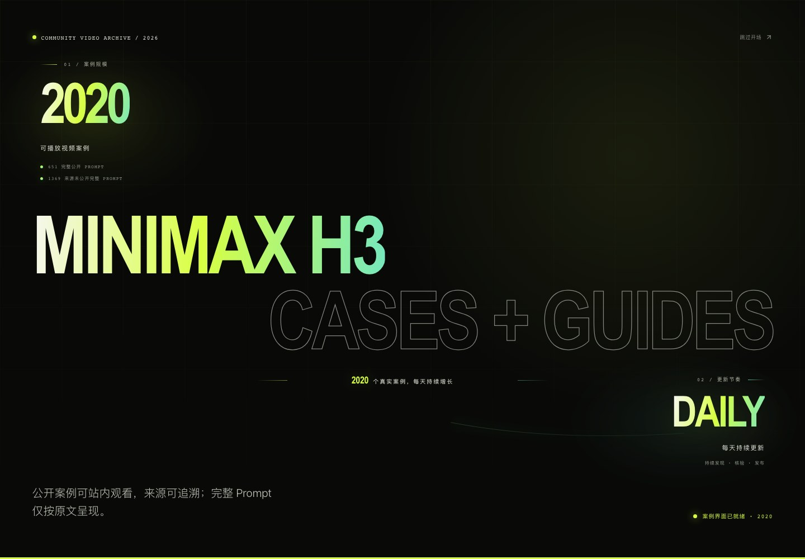
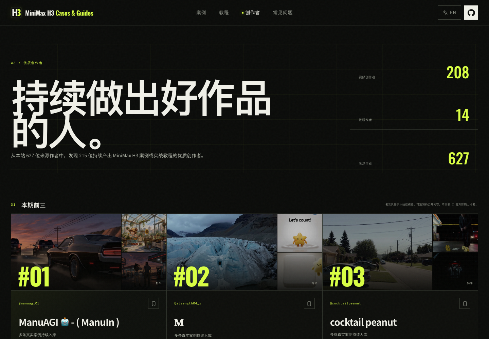
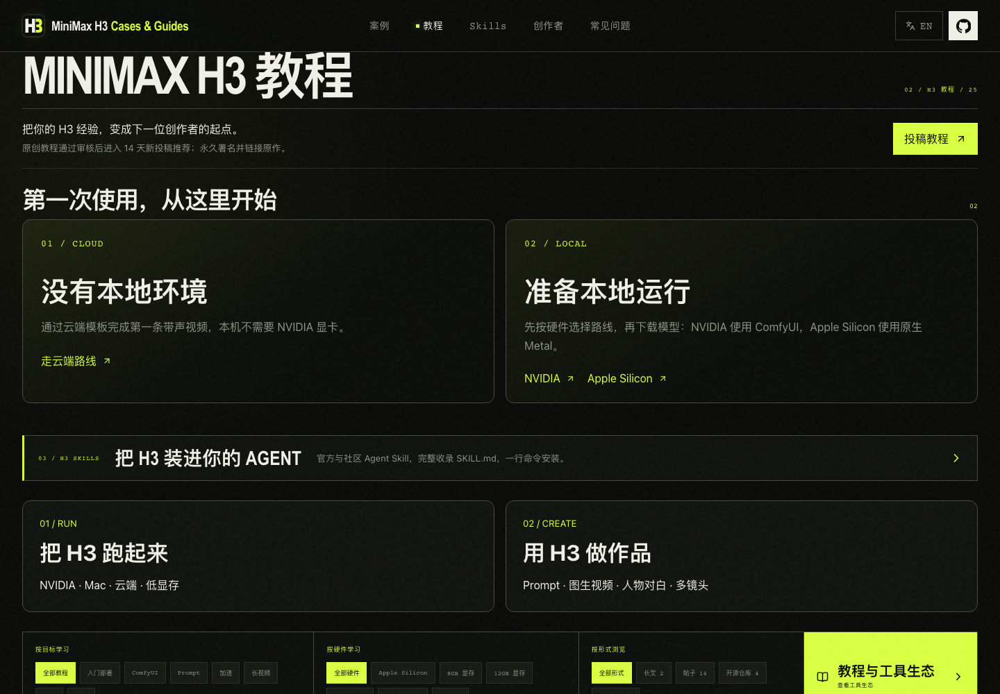
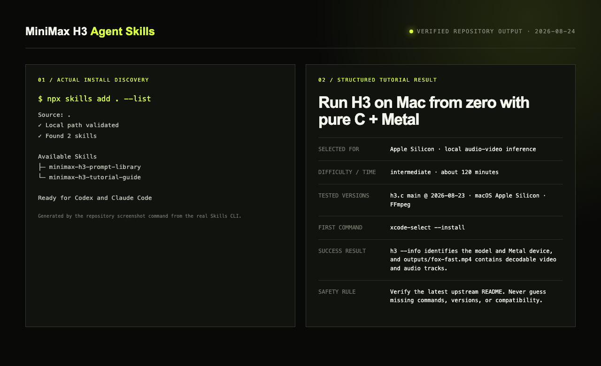

<div align="center">

<a href="https://h3-field-notes-production.up.railway.app/"></a>

# MiniMax H3 Cases & Guides｜案例与实战教程

<!-- project-stats:start -->
**更完整、更可信的 MiniMax H3 案例与教程库：1020 个可播放视频、317 条完整公开 Prompt、24 篇实用教程。**
<!-- project-stats:end -->

[English](./README.md) · **简体中文**

[](https://github.com/SkyNotSilent/awesome-minimax-h3-cases/stargazers)
[](https://github.com/SkyNotSilent/awesome-minimax-h3-cases/forks)
[](https://h3-field-notes-production.up.railway.app/)
[](https://h3-field-notes-production.up.railway.app/?collection=prompt)
[](https://h3-field-notes-production.up.railway.app/tutorials/)
[](https://h3-field-notes-production.up.railway.app/creators/)
[](https://github.com/SkyNotSilent/awesome-minimax-h3-cases/actions/workflows/ci.yml)
[](https://github.com/SkyNotSilent/awesome-minimax-h3-cases/releases)
[](./LICENSE)

</div>

[](https://h3-field-notes-production.up.railway.app/)

<p align="center"><strong>先看真实成片；来源完整公开 Prompt 才按原文展示；再沿着核验过的路线从零跑起来。</strong></p>

[](https://h3-field-notes-production.up.railway.app/)

## 直接开始

| 浏览案例 | 只看完整 Prompt | 发现优质创作者 | 从零学教程 | 安装 Agent Skill |
| --- | --- | --- | --- | --- |
| [观看全部案例](https://h3-field-notes-production.up.railway.app/) | [打开 Prompt 集合](https://h3-field-notes-production.up.railway.app/?collection=prompt) | [打开创作者榜单](https://h3-field-notes-production.up.railway.app/creators/) | [进入教程库](https://h3-field-notes-production.up.railway.app/tutorials/) | [跳到安装命令](#agent-skills) |

MiniMax H3 也常被搜索为 **Hailuo H3**、**Hailuo 3.0**、**海螺 H3** 和 **海螺 3.0**。每条公开案例都可站内播放、保留创作者与原始来源，并明确区分“完整公开 Prompt”和“来源未公开”。本站绝不反推、补写、改写或伪造缺失 Prompt。

## 看清上次访问后更新了什么

新用户默认从完整案例库开始，不会把既有档案显示成几百条未读。老用户回访时如果有新内容，首页会自动进入固定的 **本次新增** 快照：同时汇总新增案例与教程、显示最后收录日期，并在本次页面里持续保留这批内容，即使本地状态已经记为已读。

- 案例与教程统一支持 **本次新增、今天、近 7 天、近 30 天、全部**；日期条件会与搜索、时长、Prompt、快捷集合、内容、风格、场景、目标和硬件筛选取交集。
- 每张案例卡和教程卡都显示本站收录日期；本次快照里的内容另外显示文字 **新收录**，不只靠颜色表达。
- 首页可用 `added=unseen&since=<ISO 时间>` 跳转到同一批新增教程；其他日期视图使用 `added=today|7d|30d`。
- 已读进度仅保存在当前浏览器的 `minimax-h3-updates-seen-through-v1`，不增加账号、服务端历史、通知订阅或用户跟踪。

## 更快找到值得看的案例

首页继续案例优先。快捷集合可以与时长、Prompt、内容、风格、场景和搜索组合使用：

- [编辑精选](https://h3-field-notes-production.up.railway.app/?collection=featured)：可播放、来源明确且带完整公开 Prompt 的代表案例；
- [最新收录](https://h3-field-notes-production.up.railway.app/?collection=latest)：保留原兼容入口，现按首次进入本站目录的时间排序，而不是来源发布时间；
- [官方案例](https://h3-field-notes-production.up.railway.app/?collection=official)：MiniMax 可复现脚本与公开证据；
- [长视频](https://h3-field-notes-production.up.railway.app/?collection=long)：集中查看超过 15 秒的输出；
- **我的收藏**：仅保存在当前浏览器，不用登录、不跟踪、不上传云端。

还可继续浏览 **电影感、真人、动画、人物对白、纯特效、产品、角色、模型对比** 等内容标签；打开卡片即可查看站内视频、公开元数据、Prompt 来源说明和原始 X 链接。

| 电影感与特效 | 真人与对白 | 动画与角色 | 产品与对比 |
| --- | --- | --- | --- |
| 电影级镜头、运镜、变形和视觉效果 | 真人表演、对白、情绪与生活场景 | 动漫、插画、生物和风格化世界 | 广告、产品演示与模型对比 |

## 找到持续做出好作品的人

[](https://h3-field-notes-production.up.railway.app/creators/)

<!-- creator-stats:start -->
动态创作者榜把案例库变成持续复利的发现系统。目前从 **627 位来源明确的 X 作者中筛选出 215 位优质创作者**，可查看综合优质、近期活跃、案例最多、Prompt 贡献、新锐作者和教程作者榜。
<!-- creator-stats:end -->

- 每位作者都有独立主页，聚合可播放案例、完整公开 Prompt 与来源核验教程；
- 排名只使用本站已经核验并发布的公开内容，不代表 X 官方影响力；
- 内部监控分、被拒帖子、发现来源和检查频率绝不公开；
- 可以匿名收藏作者，也可以直接跳转原始 X 主页关注。

## 按目标或硬件学会 H3

[](https://h3-field-notes-production.up.railway.app/tutorials/)

教程页上来就是 4 条 0→1 核心路线，下面直接展示社区实战，不再绕到 GitHub 链接目录。8 篇旗舰教程补齐了核验版本、准确命令、预期输出、完成判断、常见错误和回退方式。

| 你的目标 | 建议入口 |
| --- | --- |
| 第一次生成视频 | [官方 / NVIDIA + ComfyUI 路线](https://h3-field-notes-production.up.railway.app/tutorials/official-deployment/) |
| Apple Silicon | [纯 C + Metal 原生路线](https://h3-field-notes-production.up.railway.app/tutorials/mac-native/) |
| 8–12GB 显存 | [量化与低显存路线](https://h3-field-notes-production.up.railway.app/tutorials/four-bit-eight-gb/) |
| 更快预览与成片 | [Turbo 路线](https://h3-field-notes-production.up.railway.app/tutorials/nvidia-comfyui/) |
| 长视频、音频或训练 | [按目标和硬件筛选](https://h3-field-notes-production.up.railway.app/tutorials/) |
| 比较开源工具 | [教程与工具生态](https://h3-field-notes-production.up.railway.app/tutorials/ecosystem/) |

每篇教程都有“一键复制给 AI”：根据结构化字段生成执行任务，并强制要求 Agent 先检查上游最新 README，禁止猜测缺失命令或兼容性。

## Agent Skills

一条命令同时安装到 Codex 与 Claude Code：

```bash
npx skills add https://github.com/SkyNotSilent/awesome-minimax-h3-cases \
  --skill minimax-h3-prompt-library minimax-h3-tutorial-guide \
  --agent codex claude-code
```



| Skill | 能做什么 | 不会做什么 |
| --- | --- | --- |
| [`minimax-h3-prompt-library`](./agents/skills/minimax-h3-prompt-library/) | 查真实案例；来源完整公开时返回逐字 Prompt | 不生成、不改写、不翻译、不反推 Prompt |
| [`minimax-h3-tutorial-guide`](./agents/skills/minimax-h3-tutorial-guide/) | 根据系统、GPU、显存、时间和目标选择核验路线 | 不猜命令、版本或兼容性 |

教程 Skill 的实际输出包含：推荐路线、环境检查、执行计划、成功标准、回退方式与带日期的来源。

## 数据、自动化与可信度

<!-- project-snapshot:start -->
**当前自动统计：** 1020 个案例 · 317 条完整公开 Prompt · 24 篇教程 · 627 位来源作者中的 215 位优质创作者 · 8 篇旗舰教程 · 15 个生态资源 · 内容核验至 2026-08-24。
<!-- project-snapshot:end -->

- [`data/project-stats.json`](./data/project-stats.json) 是公开数字的唯一快照；网站与 README 数字过期会让 CI 失败；
- [`data/cases.json`](./data/cases.json) 保存案例元数据；创作者视频不进入 Git，统一放在项目存储；
- [`data/tutorial-guides.json`](./data/tutorial-guides.json) 保存双语结构化教程；[`data/tutorials.json`](./data/tutorials.json) 保存带日期的生态快照；
- [`data/creators.json`](./data/creators.json) 根据已发布案例与教程自动生成；私有作者雷达只保存在被忽略的 `.review/`；
- 每个公开案例和教程都有不可变的 ISO `addedAt`，表示首次进入本站公开目录的时间；来源 `publishedAt`、审核 `approvedAt` 与教程 `verifiedAt` 保持独立含义，改文案、补 Prompt、刷新数据或重新核验都不会触发未读；
- 每日案例发现与每周教程发现的私有候选只进 `.review/`；凭据和发现来源标签不会进入 Git、前端或 SEO；
- 构建会生成中英文案例/教程页、canonical、hreflang、`VideoObject`/`HowTo` JSON-LD、sitemap、OG、[`llms.txt`](./public/llms.txt) 与 [`llms-full.txt`](./public/llms-full.txt)。
- `npm run screenshots` 会重新构建网站、模拟老用户回访快照、验证中英文桌面与手机路由，并从当前统计和教程数据自动刷新 README 全部截图。

## 投稿、纠错与下架

先看 [贡献指南](./CONTRIBUTING.md)，再选择对应入口：

- [提交视频案例](https://github.com/SkyNotSilent/awesome-minimax-h3-cases/issues/new?template=case-submission.yml)
- [提交实战教程](https://github.com/SkyNotSilent/awesome-minimax-h3-cases/issues/new?template=tutorial-submission.yml)
- [报告媒体失效](https://github.com/SkyNotSilent/awesome-minimax-h3-cases/issues/new?template=broken-media.yml)
- [反馈 Prompt 来源争议](https://github.com/SkyNotSilent/awesome-minimax-h3-cases/issues/new?template=prompt-dispute.yml)
- [请求纠错或下架](https://github.com/SkyNotSilent/awesome-minimax-h3-cases/issues/new?template=takedown.yml)
- [纠正、合并或下架创作者主页](https://github.com/SkyNotSilent/awesome-minimax-h3-cases/issues/new?template=creator-correction.yml)
- [展示作品或建议教程](https://github.com/SkyNotSilent/awesome-minimax-h3-cases/discussions)

## Release 与增长

[查看 Changelog](./CHANGELOG.md) · [关注 Releases](https://github.com/SkyNotSilent/awesome-minimax-h3-cases/releases) · [浏览 GitHub 案例目录](./CATALOG.md)

[](https://www.star-history.com/#SkyNotSilent/awesome-minimax-h3-cases&Date)

## License 与致谢

代码使用 MIT License。视频、Prompt、姓名及其他收录内容仍受原作者和来源平台条款约束。本社区项目与 MiniMax 无隶属关系。

产品包装参考了优秀开放案例库 [awesome-gpt-image-2](https://github.com/freestylefly/awesome-gpt-image-2)；教程组织也参考了 [MiniMax-H3](https://github.com/MiniMax-AI/MiniMax-H3)、[h3.c](https://github.com/antirez/h3.c)、[ComfyUI-wiki](https://github.com/602387193c/ComfyUI-wiki) 与 [OpenMontage](https://github.com/calesthio/OpenMontage)。本站案例数据、教程结构、视觉设计和实现均围绕 MiniMax H3 Cases & Guides 独立完成。
